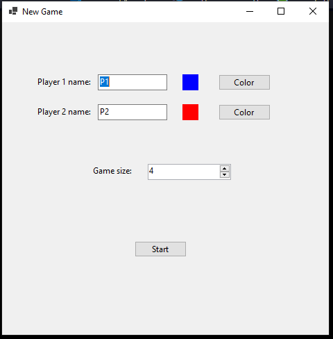
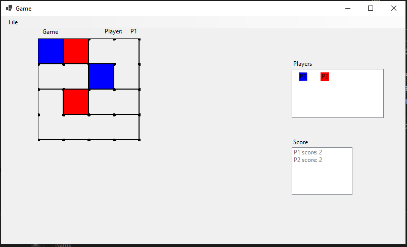

# Make It Square

## Overview

"Make It Square" is a two-player game where each player takes turns placing a line between two dots. The objective is to complete squares on the grid. When a player completes a square, it is filled with their designated color. The player with the most completed squares at the end of the game wins.

## Getting Started

### Launching the Game

1. **Set Player Names and Colors**: In the `New Game` window:
   - Enter names for Player 1 and Player 2.
   - Select colors for both players by clicking the `Color` button next to each player's name.
2. **Set Game Size**: Choose the size of the game grid from the `Game size` dropdown menu.
3. **Start the Game**: Click the `Start` button to begin the game.

### Game Window

The main game window consists of the following sections:

1. **Game Grid**: This is where the players place lines to form squares.
2. **Player Turn Indicator**: Displays which player's turn it is.
3. **Players Section**: Shows the colors assigned to Player 1 and Player 2.
4. **Score Section**: Displays the current scores of both players.

## How to Play

1. **Take Turns**: Players take turns placing a line between two adjacent dots on the grid.
2. **Complete Squares**: When a player places a line that completes a square, the square is filled with that player's color.
3. **Scoring**: Each completed square counts as one point. The score is updated in the `Score` section.
4. **End of Game**: The game ends when all possible squares are completed. A pop-up window will display the winner and prompt if the players want to play another game.

## Winning the Game

The player with the most squares completed at the end of the game is the winner. A pop-up message will announce the winner and provide options to start a new game or exit.
